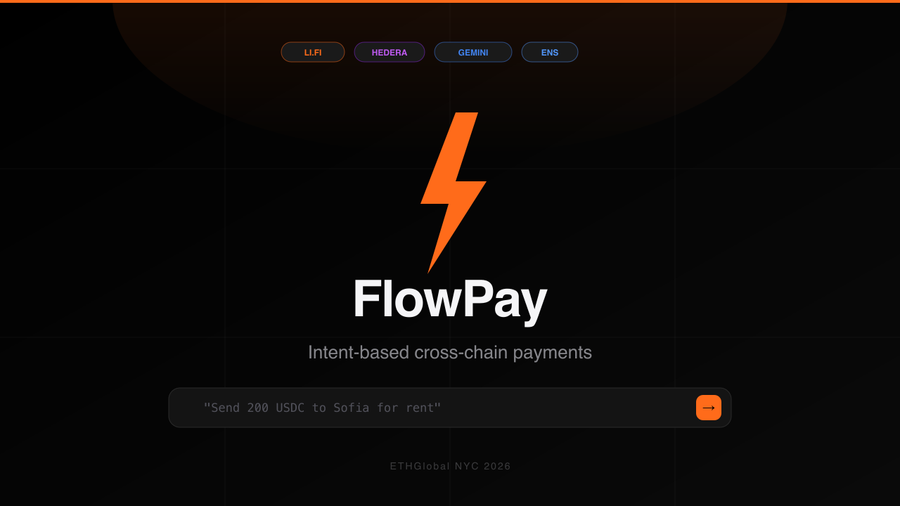
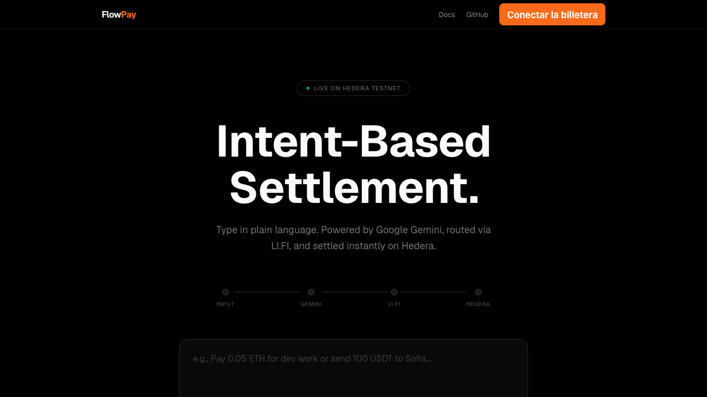
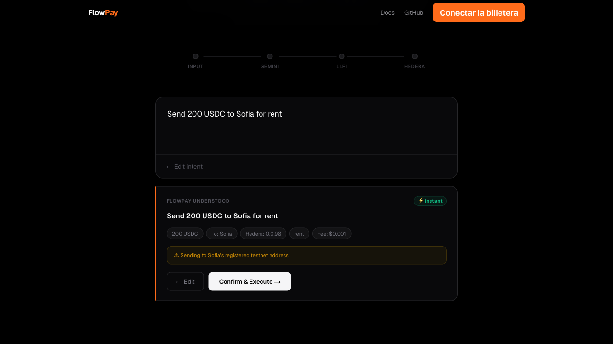
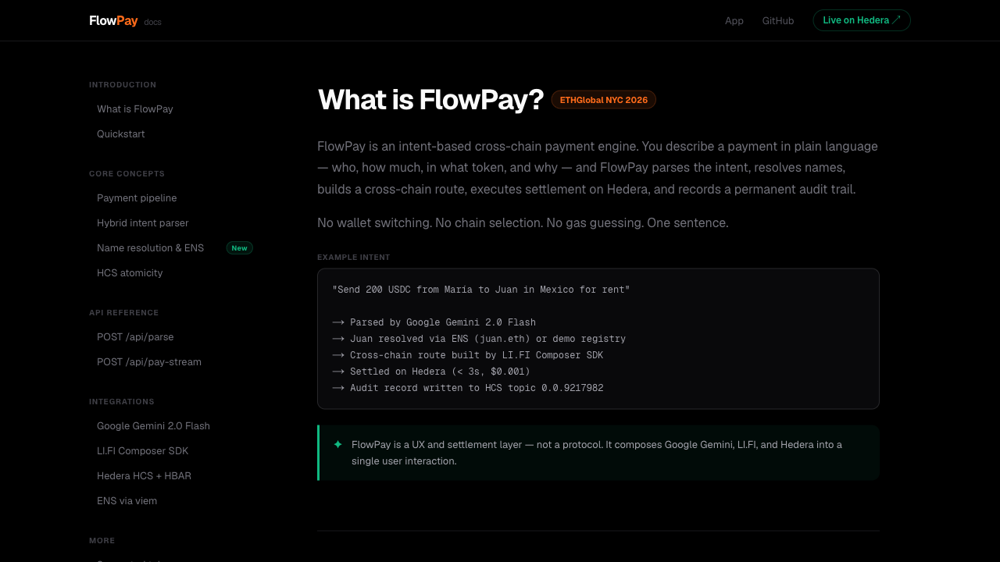

<div align="center">


# FlowPay

### Intent-based cross-chain payments in plain language

**Type what you want to pay. FlowPay handles the rest.**

[](https://flowpay-delta.vercel.app)
[](https://ethglobal.com)
[](https://typescriptlang.org)
[](https://nextjs.org)



</div>

---

## The Problem

Sending crypto today requires 5+ manual steps every single time: pick the right chain, pick the right token, find the wallet address, approve the contract, sign the transaction.

**FlowPay collapses all of this into a single sentence.**

```
"Send 200 USDC to Sofia for rent"
```

---

## Demo

<div align="center">

| Homepage | Intent Typed | Confirmation Card |
|----------|-------------|-------------------|
|  |  |  |




</div>

---

## How It Works

```
┌─────────────────────────────────────────────────────────────┐
│                     User Intent (NL text)                    │
└───────────────────────────┬─────────────────────────────────┘
                            │  POST /api/parse
                            ▼
┌─────────────────────────────────────────────────────────────┐
│           STEP 1 — Hybrid Intent Parser                      │
│                                                              │
│   ⚡ Keyword engine (instant, zero API call)                 │
│      Explicit amount + token + known recipient → HIGH conf   │
│                                                              │
│   🤖 Google Gemini 2.0 Flash (ambiguous intents only)       │
│      Structured Output → typed PaymentIntent JSON            │
│                                                              │
│   Name resolution: demo registry (14 names, instant)         │
│                 → ENS via viem on Ethereum mainnet           │
│                 → null → 422 (inline address input)          │
└───────────────────────────┬─────────────────────────────────┘
                            │  Confirmation card + ⚡ badge
                            │  User clicks "Confirm & Execute"
                            │  POST /api/pay-stream (SSE)
                            │  Pre-parsed JSON reused — no re-parse
                            ▼
┌─────────────────────────────────────────────────────────────┐
│           STEP 2 — LI.FI Composer SDK                        │
│   Builds atomic cross-chain EVM flow                        │
│   Same token → direct transfer                              │
│   Different tokens → swap via aggregator                    │
└───────────────────────────┬─────────────────────────────────┘
                            ▼
┌─────────────────────────────────────────────────────────────┐
│           STEP 3 — Hedera HBAR Settlement                    │
│   Native HBAR transfer — zero Solidity, native SDK only     │
│   Uses parsed hederaRecipient or manual 0.0.X address       │
│   Returns Hashscan receipt URL                              │
└───────────────────────────┬─────────────────────────────────┘
                            ▼
┌─────────────────────────────────────────────────────────────┐
│           STEP 4 — HCS Audit Record                          │
│   Topic: 0.0.9217982 (public, immutable)                    │
│   SUCCESS only written after on-chain confirmation           │
│   ROUTING_FAILED / PAYMENT_FAILED on error paths            │
└─────────────────────────────────────────────────────────────┘
                            │  SSE: {type:'done', data}
                            ▼
                    Receipt + Hashscan links + ⚡ Settled in Xs
```

All 4 steps emit real-time SSE events. Pipeline nodes light up strictly on server confirmation — no fake timers.

---

## Key Engineering Decisions

### Parse-once, execute-once
The `PaymentIntent` object parsed in the preview step is sent back to `/api/pay-stream` on confirm. The backend validates and reuses it directly — **Gemini is called exactly once per payment, never twice.**

### Hybrid parser: keyword engine → Gemini fallback
`lib/keyword-parser.ts` runs first on every intent. If it finds an explicit amount + token + known recipient, it returns `HIGH` confidence and the result is used directly — zero API calls, instant response. A `⚡ instant` badge appears in the UI when this path is taken.

### ENS name resolution
`lib/resolver.ts` resolves names in order: (1) demo registry (instant) → (2) `viem.getEnsAddress()` on Ethereum mainnet. Plain names are auto-suffixed to `.eth`. If both miss → 422 with inline address input for recovery.

### HCS atomicity enforced
`SUCCESS` is only written to HCS after the HBAR payment confirms on-chain. Failures write `ROUTING_FAILED` or `PAYMENT_FAILED`. No silent false-positives on the audit trail. Messages are size-validated before submission (Hedera 1KB limit).

### Stage-aware UI state machine
`idle` → `previewing` → `confirming` → `executing` → `done`. Each stage shows its own CTA — no ambiguous disabled grey buttons.

---

## Tech Stack

| Layer | Technology |
|-------|-----------|
| Intent parser (fast path) | `lib/keyword-parser.ts` — deterministic regex, zero latency |
| Intent parser (fallback) | Google Gemini 2.0 Flash · Structured Outputs |
| Name resolution | 14-name demo registry → ENS via `viem.getEnsAddress()` |
| Cross-chain routing | LI.FI Composer SDK |
| Settlement | Hedera HBAR · `@hashgraph/sdk` |
| Audit trail | Hedera Consensus Service · topic `0.0.9217982` |
| Streaming | Next.js App Router native SSE |
| Rate limiting | In-memory per-IP bucket · `lib/rate-limit.ts` |
| Wallet | wagmi v2 + RainbowKit v2 |
| Frontend | Next.js 16.2.9 · Tailwind CSS v4 · TypeScript strict |
| Deploy | Vercel |

---

## Resilience

| Scenario | Behavior |
|----------|----------|
| Keyword engine resolves intent | Gemini never called — zero latency, `⚡ instant` badge |
| Ambiguous intent | Gemini invoked, `AI-assisted` badge shown |
| `GOOGLE_API_KEY` absent | Fallback regex parser activates automatically |
| `LIFI_API_KEY` absent | Simulated route, flow continues for demo |
| Unknown name, not in ENS | 422 — inline address input appears |
| User provides `0.0.X` manually | Applied directly as Hedera recipient |
| LI.FI staging liquidity dry | `STAGING_LIQUIDITY_DRY` with actionable hint |
| HCS message > 1KB | Replaced with compact status-only record |
| Step timeout > 25s | AbortController fires — retry immediately |
| Rate limit exceeded | 429 with `Retry-After` — 30 req/min parse · 10 req/min execute |

---

## File Structure

```
flowpay/
├── app/
│   ├── api/
│   │   ├── parse/route.ts        # Hybrid parse + ENS + rate limit (30 req/min)
│   │   ├── pay/route.ts          # Single-response execution + rate limit
│   │   └── pay-stream/route.ts   # SSE pipeline — reuses clientParsed, skips Gemini
│   ├── docs/page.tsx             # Full docs site at /docs
│   ├── globals.css               # Design system · Studio Dark · animations
│   ├── layout.tsx
│   ├── page.tsx                  # Main UI — stage-aware CTA · localStorage history
│   └── providers.tsx             # wagmi + RainbowKit
└── lib/
    ├── keyword-parser.ts         # Deterministic fast-path parser
    ├── parser.ts                 # Orchestrates keyword → Gemini → fallback
    ├── resolver.ts               # Demo registry + live ENS via viem
    ├── lifi.ts                   # LI.FI Composer SDK integration
    ├── hedera.ts                 # HCS + HBAR transfer + size guard
    └── rate-limit.ts             # In-memory per-IP rate limiter
```

---

## Local Setup

```bash
git clone https://github.com/riesgopais/flowpay
cd flowpay
npm install
cp .env.example .env.local
npm run dev
```

App at [localhost:3000](http://localhost:3000) · Docs at [localhost:3000/docs](http://localhost:3000/docs)

### Environment Variables

```env
GOOGLE_API_KEY=       # Gemini 2.0 Flash (free tier works)
HEDERA_ACCOUNT_ID=    # Testnet operator — portal.hedera.com
HEDERA_PRIVATE_KEY=   # ECDSA private key (never commit)
LIFI_API_KEY=         # LI.FI Composer — portal.li.fi
ETHEREUM_RPC_URL=     # Optional — defaults to cloudflare-eth.com for ENS
```

---

## Sponsor Tracks

| Track | Usage |
|-------|-------|
| **Hedera — AI & Agentic Payments** | Gemini agent autonomously routes and executes HBAR transfers with HCS audit trail |
| **Hedera — No Solidity Allowed** | Zero EVM bytecode — `TransferTransaction` + `TopicMessageSubmitTransaction` only |
| **LI.FI — Agentic Workflows** | `buildCrossChainPaymentFlow()` as atomic EVM execution layer for AI-parsed intents |
| **Google Cloud — Gemini** | Structured Outputs as typed NL parser — multilingual, schema-enforced |
| **ENS** | Live `viem.getEnsAddress()` on Ethereum mainnet with `.eth` auto-suffix |

---

## HCS Audit Trail

**Topic:** [`0.0.9217982`](https://hashscan.io/testnet/topic/0.0.9217982) — public, immutable, verifiable

```json
{
  "app": "FlowPay",
  "intent": "Send 100 USDC to Sofia for rent",
  "amount": 100,
  "fromToken": "USDC",
  "toToken": "USDC",
  "recipient": "0x742d35...",
  "status": "SUCCESS",
  "timestamp": "2026-06-14T..."
}
```

---

<div align="center">

**Built solo at ETHGlobal NYC 2026 · June 12–14**

[flowpay-delta.vercel.app](https://flowpay-delta.vercel.app) · [Docs](https://flowpay-delta.vercel.app/docs) · [HCS Audit Trail](https://hashscan.io/testnet/topic/0.0.9217982)

</div>
